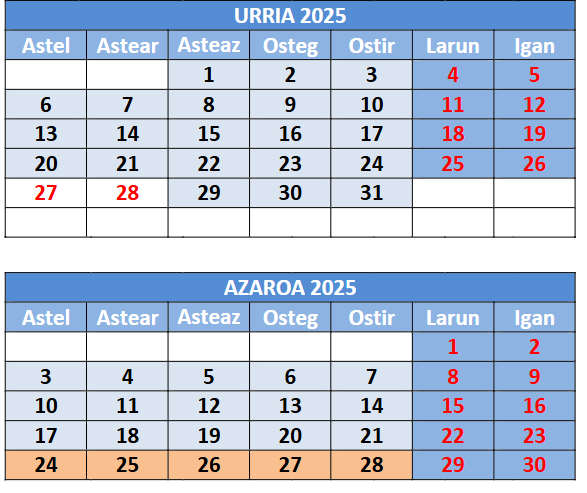
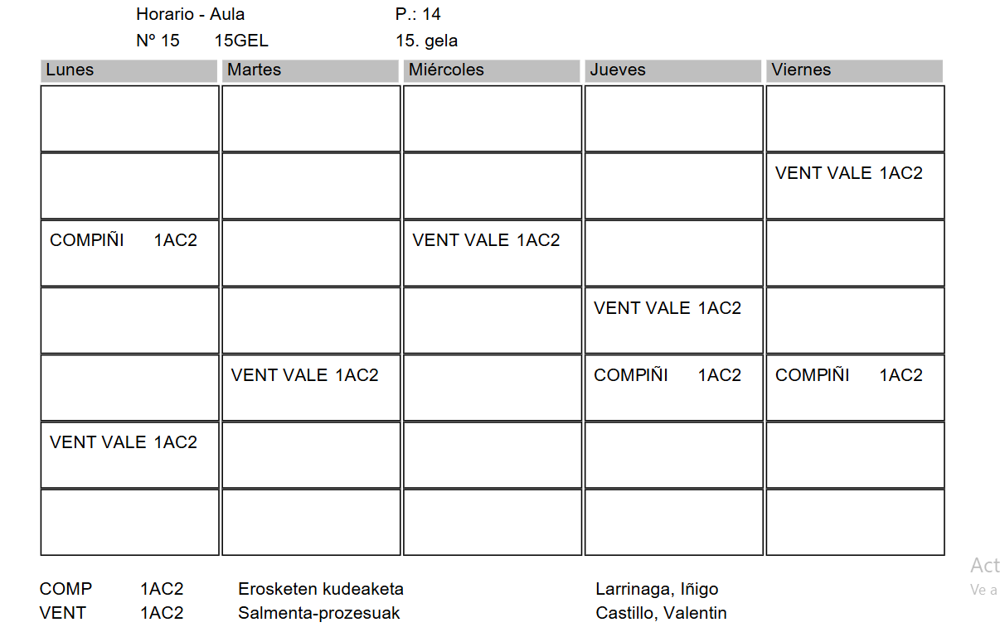

# Guía sala de realidad virtual

1. Reunión con Maria Madarieta :white_check_mark:
2. Gestión de permisos, aplicaciones y creación de usuarios en VirooCloud :white_check_mark:
3. Instalación de Unity, versión para desarrollar para Viroo :white_check_mark:
4. Instalar proyecto de muestra
5. Escribir a txema para pedir ayuda para crear las plantillas de fpcloud :white_check_mark:
6. Terminar plantilla de fpcloud con viroo single player y usuarios genéricos y guía.
7. Llevar a los alumnos de 1AWA y 1AWD a experimentar con la sala de realidad virtual, ulima semana de octubre y primeras de noviembre. 
8. Los alumnos experimentarán con los distintos programas, con las máquinas de fpcloud, viroo single player y viroo room player y documentarán las experiencias
9. Terminar la guia de uso tras la experiencia con los alumnos.
10. Imprimir Checklist de antes y despues de usar la sala.
11. Publicar mail con la referencia a la guia y ofrecer los viernes como día en el que puedo hacer de apoyo a otros profesores en las horas que la sala está disponible.

## Checklist sala de Realidad Virtual 

:white_check_mark: Apilar las mesas en una esquina a ser posible para evitar colisiones
:white_check_mark: Cerrar las persianas y encender las luces
:white_check_mark: Encender los equipos del bastión que correspondan a lo Visores que vayan a usarse.

## Checklist sala de Realidad Virtual 

:white_check_mark: Apagar los equipos que se hayan utilizado
:white_check_mark: Cerrar el armario de los Visores con llave y guardar la llame en el bastión de los equipos.
:white_check_mark: Cerrar el bastión y apagar el magnetotérmico del aula.
