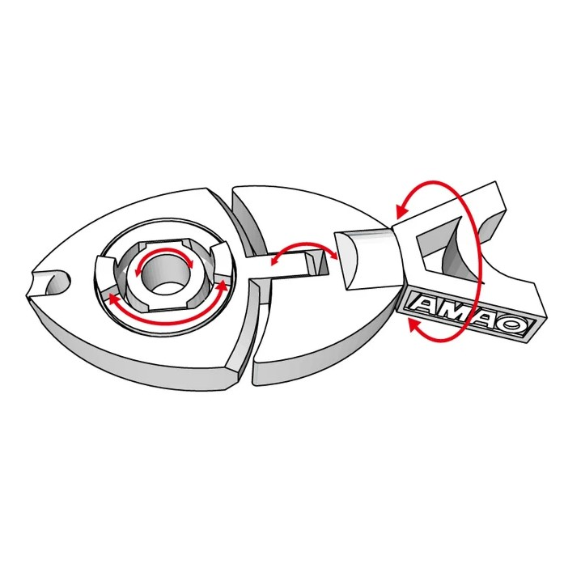
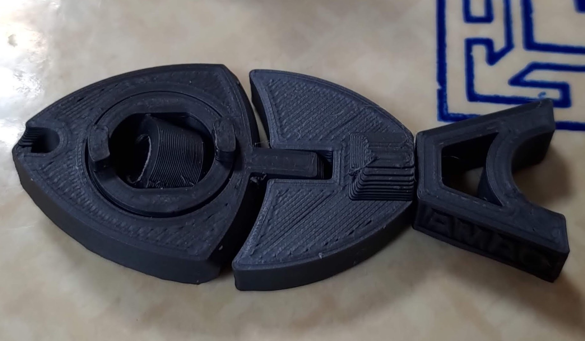

**Modelo:** [https://www.thingiverse.com/thing:4152967/makes](https://www.thingiverse.com/thing:4152967/makes)

[Enlace a archivo STL](Modelo_3d_Fish.stl)
[Enlace a archivo UFP](UMS3_Modelo_3d_Fish)

**Dimensiones utilizadas para el diseño:**

*   **X:** 111 mm
*   **Y:** 46.5 mm
*   **Z:** 15.25 mm

**Gramos y metros necesarios de bobina:**

*   **Gramos:** 26g
*   **Metros:** 3.32m

**Parámetros de impresión modificados:**

*   **Calidad:**
    *   Altura de capa: 0.06 mm
*   **Paredes:**
    *   Grosor de pared: 0.8 mm
    *   Recuento de líneas de pared: 2
    *   Expansión horizontal: -0.006 mm
*   **Relleno:**
    *   Densidad de relleno: 10 %
    *   Patrón de relleno: Cuadrícula
*   **Ajustes experimentales:**
    *   Usar capas adaptativas

---

¿Hay algo más en lo que pueda ayudarte?

