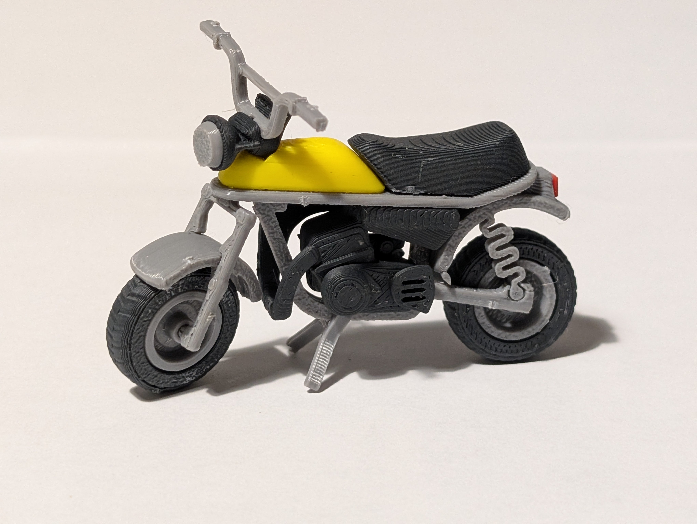
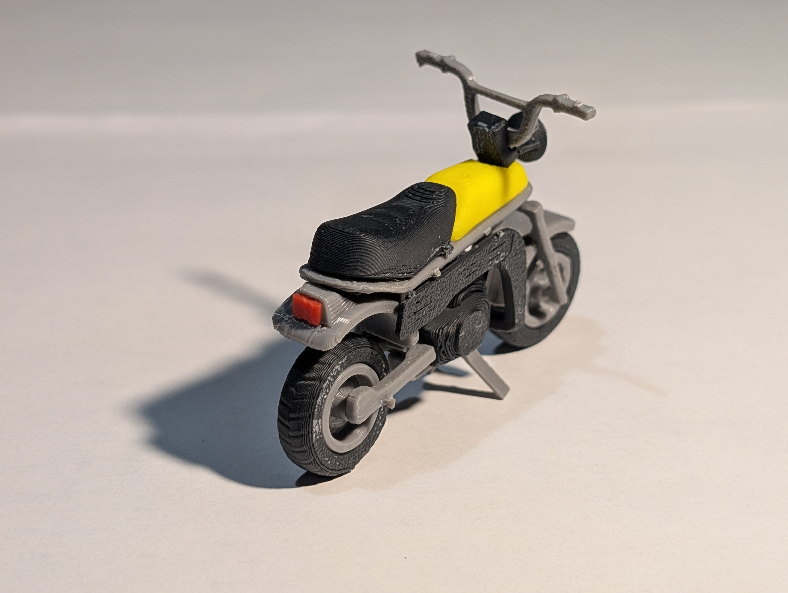

# Suzuki PV50 kitcard

## ¿Que tipo de moto es la *Suzuki PV50*?
Este es un modelo de la *Suzuki PV50*, una minimoto clásica de los años 80, conocida como "pleasure vehicle" o "moped" que se hizo popular entre los jóvenes en países como Finlandia, y que competía con la Honda Monkey. Se caracteriza por su motor de 2 tiempos de 50cc, diseño ligero y las amplias posibilidades de personalización para aumentar su potencia, llegando a superar los 100 km/h.   

## ¿Cuál es el propósito del modelo?

El proposito del modelo es recrear una moto articulable de una suzuki PV50, saber el funcionamiento de crear un proyecto colaborativo en github y probar las diferentes opciones de la impresion 3D

### Y... ¿El verdadero propósito del modelo?

El modelo lo hemos descargado de la pagina Thingverse ([https://www.thingiverse.com/thing:7155383]) y fue creado por el usuario "pekonimato" , lo hizo en 4 piezas diferentes para poder imprimirlas por colores, nosotros nos hemos descargado este modelo porque nos ha parecido muy interesante al tener piezas moviles, una vez impresa se monta con pegamento de contacto y tanto las ruedas como el manillar se mueven libremente.
Otro de los objetivos es hacer uso del Software "ultimaker cura" con el que se pueden hacer diferentes configuraciones en el modelo, nosotros hicimos diferentes cambios para que la pieza fuese mas ligera y tardase menos en imprimirse  

Es una pieza interactiva y una figura genial para tener en la estanteria.

  