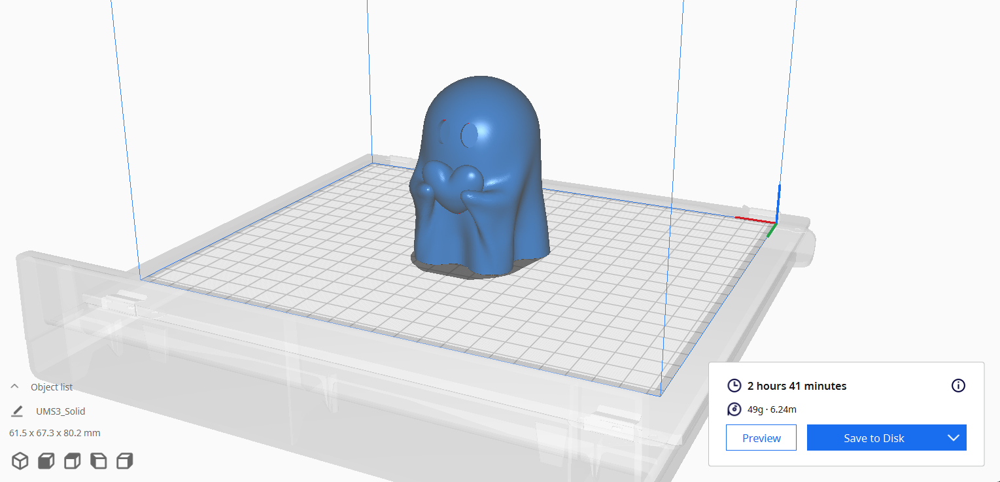
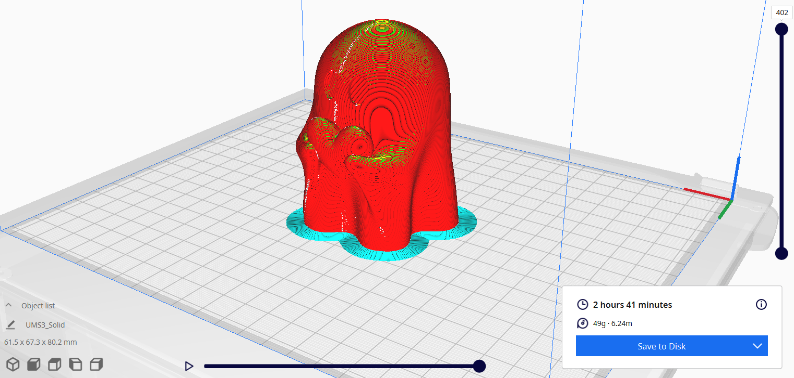

# HALLOWEEN MAMUA
 

## Zertarako erabili ahal da?
Mamu honek ez du erabilera funtzionalik, baina bai estetikoa. Honen, erabilera printzipala halloweeneko apaingarri bat izatea da edota hau pasata ere, etxeko edozein lekutan jarri ahal duzu zure gustoaren arabera. Gainera goikaldean borobiltxo bat gehituta giltzetan ere jarri ahal duzu "llavero" bat bezala, baina tamaina eta forma deseorosoa izan ahal da boltsikoetan eramateko. Edo opari polit bat izan ahal da ezagun batentzako.   

## Ezaugarriak:
Denbora totala: 2 ordu eta 41 minutu
Pisua: 49 gramo
Altuera: 80 mm
Lodiera:67 mm eta 61mm
Materialaren tamaina: 0,2 mm(azkarra)
#### Oharra:
Ez du izango zutaberik ezta baserik eta hormak 0.8 mm-koak izango ditu, baina barrutik geratzen den tartea hutsik egongo da eta "txikia" denez, uset dut ez duela arazorik izango goiko partea sortzerakoan eta ez duela zutabe beharrik izango.

## Bista motak:
- ### [Mamua.stl](Solid.stl)
### eta
- ### [Mamua.upf](mamua.ufp)