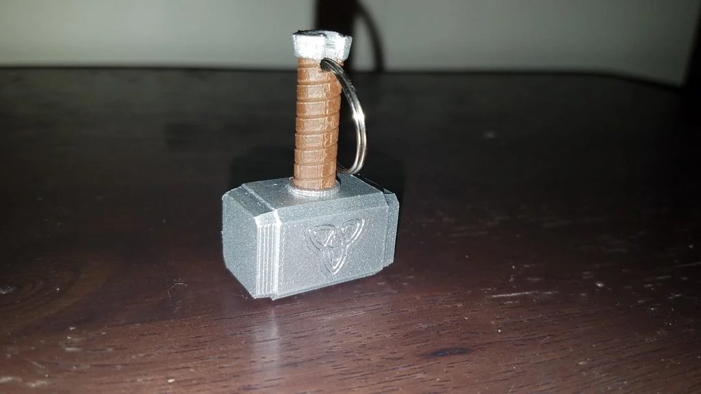

# ¿Que es el Mjolnir?

Este es un llavero básico del martillo de Thor (Mjolnir). Tiene un tamaño normal para un llavero, aunque conserva buena resistencia y durabilidad.

### ¿Como imprimirlo?
Recomiendo imprimirlo de lado con el emblema de Asgard hacia arriba. Imprima con soportes para el mango, ya que comenzará aproximadamente a la mitad de la impresión. Yo lo hice con un 30 % de relleno y una altura de capa de 0,1 mm. Sin balsa.

Para la pintura, usé pintura en aerosol plateada metalizada y pintura en aerosol esmaltada marrón sin brillo. Usé cinta de pintor para separar los segmentos; no fue necesario pintar a mano.

[Archivo upf para la impresora](UM3_Thor_Hammer_Keychain_Mk12.3mf)

[Archivo stl del martillo](Thor_Hammer_Keychain_Mk12.stl)