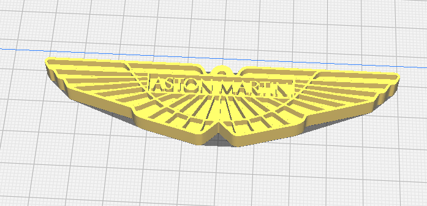

# Catalogo

> Repositorio con modelos 3D para impresión y ejemplos de buenas prácticas.

| Modelo | Miniatura |
|--------|-------------|
| [Fractal](<fractal (ejemplo)/fractal.md>) | </a> |
| [Aston Martin Giltzarria](<benat/Aston_Martin.pdf>) | </a> |
| [Flor de loto](<Gaizka_David_FlorDeLoto/FlorDeLoto.md>) | </a> |