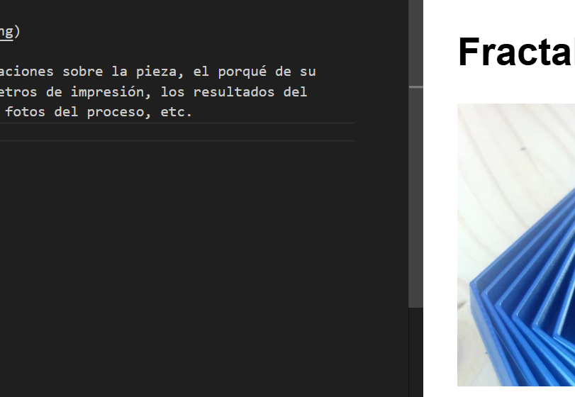

# Fractal (ejemplo)

- [Fractal (ejemplo)](#fractal-ejemplo)
  - [Azpitutuloa](#azpitutuloa)
    - [Azpi azpitutloa](#azpi-azpitutloa)
  - [Azpitut](#azpitut)
      - [Azpis](#azpis)

Aquí van tus explicaciones sobre la pieza, el porqué de su elección, los parámetros de impresión, los resultados del control de calidad, fotos del proceso, etc.

## Azpitutuloa

### Azpi azpitutloa
## Azpitut
#### Azpis

