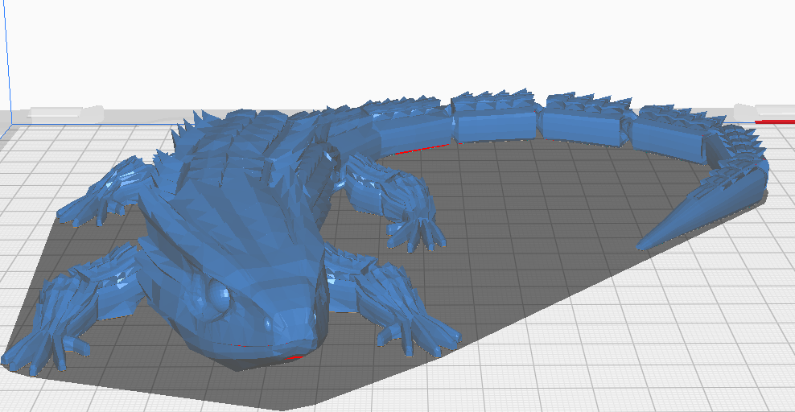

# Erakusketa-lagina: *Lizarra 3D (Sare/Flex tipologia)*

## Azpititulua
Egiturazko malgutasuna eta xehetasun handiko formak erakusteko eredua.

---

## 1. Arazoa eta Helburua 
Helburua izan da egitura malguak eta xehetasun geometriko ugari dituen pieza bat hautatzea, 3D inprimaketaren  erakusteko.

---

## 2. Pieza eta Diseinua
Aukeratutako eredua *sare edo flex* motako figura bat da, animalia formako gorputz konplexuarekin.  

Eredua, aldaketa batzuk izan ditu eredu originalatik, lotura indartsuagoak edukitzeko.

- *Tipologia:* Sare/Flex  
- *Eredua:* 3D lizarra 
- *Materiala:* ?  
- *Diseinu-iturburua:* Thingiverse / Printables eredua  
- *Tamaina:* 172.5 × 178.7 × 30.1 mm  
- *Pisu estimatua:* 90g 

---

## 3. Inprimaketa Parametroak
| Parametroa | Balioa |
|-------------|--------|
| Geruza altuera | 0.20 mm |
| Betetze portzentaia | 50% (Grid pattern) |
| Euste-egitura (supports) | Bai, automatikoki sortua |
| Inprimaketa denbora | 5 ordu 36 minutu |
| Inprimaketa softwarea | Ultimaker Cura 5.8 |

---

## 4. Ondorioak
Pieza honek erakusten du 3D inprimagailuaren gaitasuna forma irregularrak eta kurbadurak sortzeko, *malgutasuna eta xehetasuna uztartuz*.  
Gainera, *geruza-orientazioaren eta soporteen kudeaketaren garrantzia* nabarmen geratu da.

---

## 5. Loturak
- [STL fitxategia](./lizar_artikulatua.stl)  

---

*Egilea:* Yeray Garrido Parra  
*Erronka:* 1 · 3D Inprimaketa — Gidak eta Tipologien Erakusketa  
*Taldea:* Sare/Flex  
*Urtea:* 2025